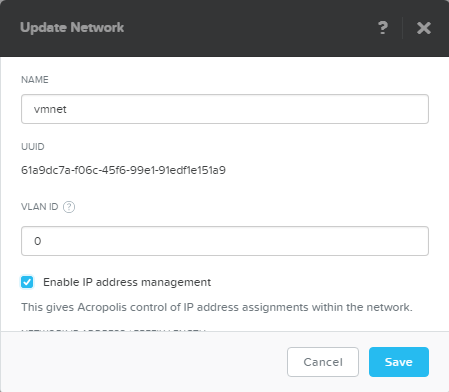
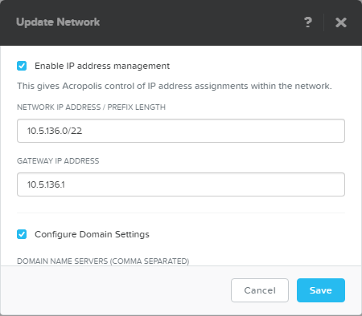
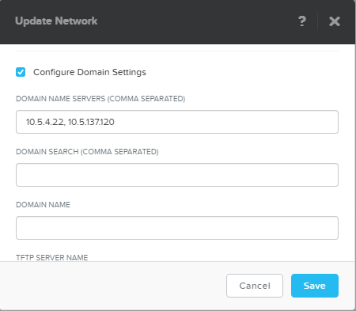
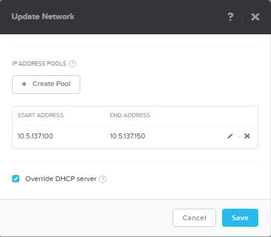

# Prepare Nutanix Cluster for BOSH deployment

**Create a Managed Network on Nutanix AHV Cluster. The following information is required:**

- VLAN Name
- VLAN ID
- Network Range (CIDR)
- Gateway IP
- DNS Server(s)
- IP Address Pool

    

    

   

**Create a new storage container or identify existing container which will be used for Cloud Foundry deployment**

## Deploy
Once the Nutanix environment is ready, follow the [auto deployment doc](auto-deployment.md) to deploy Cloud Foundry on Nutanix AHV.
